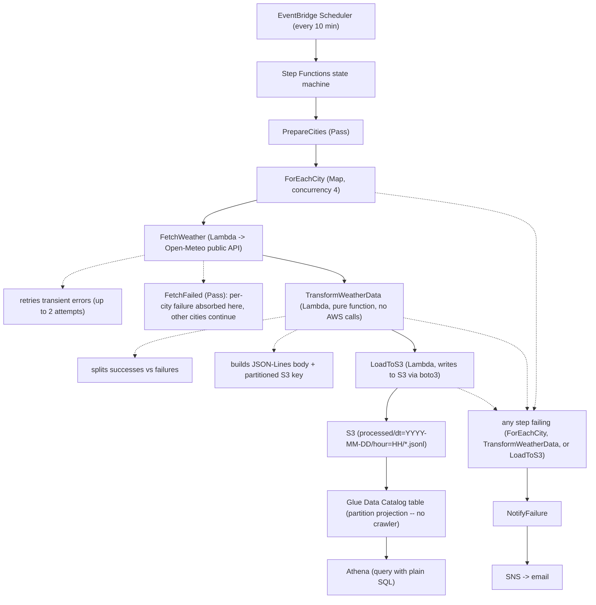

# Serverless Weather Data Pipeline

A small but complete serverless data pipeline on AWS
walkthrough: **EventBridge Scheduler → Step Functions → Lambda → S3 →
Glue/Athena**, deployed by GitHub Actions with **no AWS access keys
stored anywhere** (authentication is via GitHub's OIDC provider).



## Why this design

- **Step Functions does the orchestration, not a monolithic Lambda.**
  The Map state fetches every city in parallel, retries transient
  errors, and lets individual city failures continue past without
  failing the whole run.
- **The S3 write is a small dedicated Lambda using boto3**, not a
  Step Functions native SDK integration. A native `s3:putObject`
  integration (`states:::aws-sdk:s3:putObject`) was tried first to
  skip a Lambda entirely -- it's a neat trick when it works -- but it
  turned out to write the JSON-*string-encoded* form of the body
  (literal `\"` and `\n` characters) as the file content instead of
  raw text, so every "row" failed to parse in Athena. Worth knowing
  before you rely on `Body.$` for anything with embedded newlines. See
  [`lambdas/load/handler.py`](lambdas/load/handler.py).
- **Glue uses partition projection**, not a Crawler. Athena computes the
  `dt=`/`hour=` partitions from the query's `WHERE` clause instead of
  reading them from a catalog that something has to keep in sync (and
  pay to crawl).
- **Deploys carry no AWS credentials.** GitHub Actions exchanges an OIDC
  token for temporary AWS credentials by assuming an IAM role whose
  trust policy is scoped to this exact repo + branch. See
  [`stacks/github_oidc_stack.py`](stacks/github_oidc_stack.py).

## Repo layout

```
app.py                        CDK app entry point
stacks/
  pipeline_stack.py           The data pipeline itself
  github_oidc_stack.py        OIDC provider + scoped deploy role
lambdas/
  fetch_weather/handler.py    Calls Open-Meteo for one city (stdlib only)
  transform/handler.py        Pure transform -> JSON-Lines (stdlib only)
  load/handler.py             Writes the JSON-Lines body to S3 via boto3
tests/
  test_fetch_weather.py       Unit tests (mocked HTTP)
  test_transform.py           Unit tests (pure function, no mocking needed)
  test_load.py                Unit tests (mocked boto3)
  test_stack_synth.py         CDK assertions: resources exist, IAM is scoped
athena/sample_queries.sql     Queries to run once data has landed
scripts/trigger_and_check.py  Manually run + poll an execution
.github/workflows/
  test.yml                    Runs on every PR -- no AWS credentials needed
  deploy.yml                  Runs on push to main -- OIDC, no static keys
```

## Prerequisites

- An AWS account and a way to authenticate locally just for the
  one-time bootstrap steps below (AWS CLI + SSO, or IAM user credentials
  in your shell -- your choice, but don't commit them anywhere).
- Node.js 18+ and Python 3.12 locally.
- `npm install -g aws-cdk`

Python dependencies go in a virtual environment (`.venv/` is already in
`.gitignore`, so it never gets committed):

```bash
python3 -m venv .venv
source .venv/bin/activate          # zsh/bash. Windows: .venv\Scripts\activate
pip install -r requirements.txt -r requirements-dev.txt
```

Re-run `source .venv/bin/activate` in any new terminal tab before running
`pytest`, `cdk synth`, or `cdk deploy` -- that's what puts the CDK Python
libraries and pytest on your `PATH`. `deactivate` leaves the venv.

## One-time setup (local, with your own credentials)

These three steps happen once, from your machine, using whatever AWS
credentials you already have configured locally (a profile, SSO, etc).
Nothing from this section is ever committed to the repo.

**1. Bootstrap the AWS account/region for CDK** (creates the S3 asset
bucket and the IAM roles that `cdk deploy` uses under the hood):

```bash
cdk bootstrap aws://ACCOUNT_ID/ap-southeast-2
```

**2. Deploy the GitHub OIDC stack**, pointing it at your repo:

```bash
cdk deploy WeatherPipeline-GitHubOidc \
  --context github_owner=<your-github-username-or-org> \
  --context github_repo=<your-repo-name> \
  --context github_branch=main
```

Note the `DeployRoleArn` in the output.

> Already have a GitHub OIDC provider in this account from another
> project? AWS only allows one provider per issuer URL. Pass
> `--context existing_oidc_provider_arn=arn:aws:iam::ACCOUNT:oidc-provider/token.actions.githubusercontent.com`
> and the stack will import it instead of trying to create a duplicate.

**3. Add two GitHub repo Variables** (Settings → Secrets and variables →
Actions → **Variables** tab -- not Secrets):

| Name                  | Value                                  |
| --------------------- | -------------------------------------- |
| `AWS_DEPLOY_ROLE_ARN` | the `DeployRoleArn` output from step 2 |
| `AWS_REGION`          | e.g. `ap-southeast-2`                  |

These aren't sensitive: the role ARN is only usable by workflow runs
from this exact repo and branch (that's what the `sub` condition in
[`github_oidc_stack.py`](stacks/github_oidc_stack.py) enforces), and
knowing a region does nobody any good.

## Everything after that ships via GitHub Actions

Push to `main` and `.github/workflows/deploy.yml` runs the test suite,
then requests an OIDC token, assumes `AWS_DEPLOY_ROLE_ARN`, and runs
`cdk deploy WeatherPipeline`. No `AWS_ACCESS_KEY_ID` /
`AWS_SECRET_ACCESS_KEY` exist in this repo's configuration at all --
check the repo's Secrets tab once it's set up and you'll see it's empty.

Pull requests only run `.github/workflows/test.yml` (pytest + `cdk
synth`), which needs no AWS access whatsoever.

## Trying it without waiting for the schedule

```bash
python3 scripts/trigger_and_check.py --region ap-southeast-2
```

This starts an execution and polls it to completion, printing the
Step Functions output.

## Querying the data

Once at least one execution has succeeded, open the Athena console
(workgroup `weather-pipeline-wg`, database `weather_pipeline_db`) and
run the queries in [`athena/sample_queries.sql`](athena/sample_queries.sql).
No `MSCK REPAIR TABLE` needed -- partition projection means Athena
computes valid partitions itself.

## Cost

Everything here is pay-per-use and tiny at this scale: Lambda
invocations and Step Functions state transitions are well within the
free tier, S3 storage for a few JSON files is fractions of a cent,
and Athena charges per byte scanned (a few cents at most for a demo).
The one thing to actually watch: **the EventBridge schedule keeps
running every 10 minutes, forever, until you disable or destroy it**
-- still trivial cost at this scale, but it adds up faster than an
hourly cadence, so don't forget to dial it back down (or destroy the
stack) once you're done generating data for the post.

## Tearing down

```bash
cdk destroy WeatherPipeline
```

Leave `WeatherPipeline-GitHubOidc` in place if you plan to reuse the
same deploy role for future pushes; destroy it too if you're done with
the whole project.

## Running the tests locally

```bash
source .venv/bin/activate   # create it first with: python3 -m venv .venv
pip install -r requirements.txt -r requirements-dev.txt
pytest -v
cdk synth --context github_owner=<you> --context github_repo=<repo>
```
